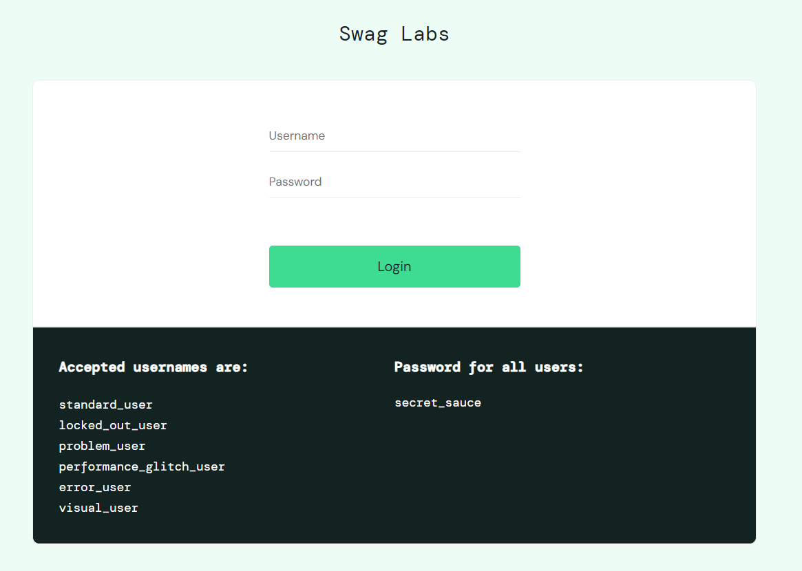

### ongoing project...
# Swag Labs webshop-Selenium-Python
### [System Under Test (SUT)](https://www.saucedemo.com/) :


## Overview
This project leverages Selenium's capabilities to automate UI tests across different scenarios in a [webshop](https://www.saucedemo.com/) application, 
ensuring functionality, reliability, and user interface responsiveness.

## Built with
* [![Python][Python]][PYTHON-URL]
* [![Selenium][Selenium]][SELENIUM-URL]
* [![Cucumber][Cucumber]][CUCUMBER-URL]

## Prerequisites
Before you begin, ensure you have the following installed on your machine:  

```bash

python --version
pip show selenium
behave --version
```

## Installation
1. Clone the repository:
```bash
git clone git@github.com:arvamartin/webshop-selenium-python.git
```

2. If they are not already installed:
* Python:
  * Installing Python from the official [website](https://www.python.org/downloads/):
    * Click the Download Python button, which contains the latest version.
    * Run the downloaded installer file.
    * Very important! When starting the installer, check the option "Add Python to PATH," then click the Install Now button.

```bash
pip install selenium
pip install behave
``` 
### OR

```bash
python -m venv venv
.\venv\Scripts\activate
pip install -r requirements.txt
```

3. Run all tests:
```bash
behave     
```


[Python]: https://img.shields.io/badge/python-3670A0?style=for-the-badge&logo=python&logoColor=ffdd54
[PYTHON-URL]: https://www.python.org/
[Selenium]: https://img.shields.io/badge/-selenium-CB02A?style=for-the-badge&logo=selenium&logoColor=white
[SELENIUM-URL]: https://www.selenium.dev/
[Cucumber]: https://camo.githubusercontent.com/788fbe630f1bafea0c87198f6e3e24e3f03eeef9899248581afc757f11ff5054/68747470733a2f2f696d672e736869656c64732e696f2f62616467652f437563756d6265722d3433423032413f7374796c653d666f722d7468652d6261646765266c6f676f3d637563756d626572266c6f676f436f6c6f723d7768697465
[CUCUMBER-URL]: https://cucumber.io/

